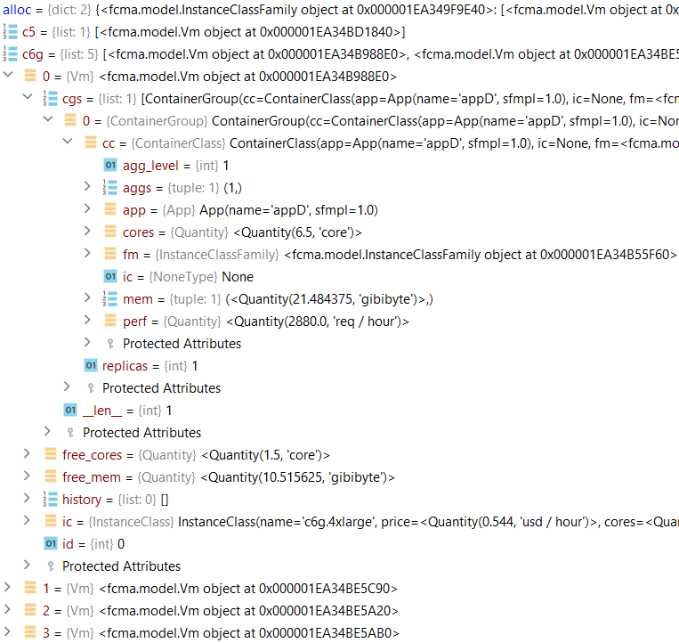
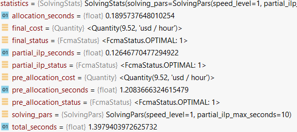

FCMA
==========

A set of algorithms that implement Fast Container to Machine Allocators.

Introduction
------------

FCMA is a Python package to solve allocation problems in Container as a
Service (CaaS) deployed on Infrastructure as a Service (IaaS) clouds. The
objective is to optimize the cost from the point of view of the cloud customer.

Other projects like [Conlloovia](https://github.com/asi-uniovi/conlloovia)
perform a similar work, but the difference is that FCMA focuses on reducing the 
problem resolution time, facilitating the optimization of large problems, made of 
many applications and instance classes. Nevertheless, solutions may not be optimal.

Inputs:

- A set of applications.
- Workload for applications.
- Computational parameters for pairs instance class family and applications.

Instance classes are organized in families inside FCMA. A FCMA family is made up of 
instance classes with identical performance per core, assuming there is enough memory 
to run the applications. An example of family definitions can be found in file 
[aws_eu_west_1.py](examples/aws_eu_west_1.py). In that file, AWS c5, AWS m5 and AWS r5 
instances have the same performance per core for any application. The instances differ in the number of cores
and memory, but the cost per core is constant. 
File [aws_eu_west_1.py](examples/aws_eu_west_1.py) can be used as a reference to create
new instance class families.

Outputs:

- A set of virtual machines (VMs) required to allocate the  applications, 
as well as the allocation of application containers to the VMs.
- Statistics about the solution in terms of cost, computation time and optimality.

Installation
------------
**TODO. At this time it is not available as a Python package. When available installations
will be:**

There are two ways to install the package: manually or using poetry.

### Manual install

Clone the repository:

```bash
git clone https://github.com/asi-uniovi/fcma.git
cd fcma
```

Optionally, create and activate a virtual environment:

```bash
python3 -m venv .venv
source .venv/bin/activate
```

Install the package with `pip`:

```bash
pip install .
```

If you want to be able to modify the code and see the changes reflected in the
package, install it in editable mode:

```bash
pip install -e .
```

### Installation using poetry

Poetry is a tool for ensuring that the package is installed with the correct dependencies and versions. The initial setup is more complex than the manual installation, but it is preferable for developing and publishing the package.

First be sure to have poetry installed in your system. First you require `pipx`, which is a tool that installs python tools into their own isolated environments, and adds them to your path. Follow [this instructions](https://pipx.pypa.io/stable/installation/) to install `pipx`. Then install poetry with pipx:

```bash
pipx install poetry
```

Clone `fcma` repository:

```bash
git clone https://github.com/asi-uniovi/fcma.git
cd fcma
```

Start a poetry shell (it is a virtual environment specific for this project):

```bash
poetry shell
```

Install the package (it will be installed in editable mode, for development)

```bash
poetry install
```

Remember to use `poetry shell` from `fcma` folder every time you want to work with the package in a different terminal or session.

Usage
-----
[An example](examples/example1.py) of usage can be found in the
[examples](examples) folder, which can be run with:

```bash
python examples/example1.py
```
In a short period of time the optimal solution can be seen at the output. The example
solves the allocation for 4 applications and 48 different instance classes.

If order to use the package in your own code, the scheme provided in the example can be followed. 

**1. Write the required imports.**
```python
import logging
from cloudmodel.unified.units import (ComputationalUnits, RequestsPerTime, Storage)
from fcma import (App, AppFamilyPerf, Fcma, SolvingPars)
from fcma.visualization import SolutionPrinter
```
The first import shows internal information of the solver and it is optional.
The last one is also optional, and it is required only when using the visualization module.

**2. Optionally, set the logging level to INFO to see the output of the solver.**

```python
logging.basicConfig(level=logging.INFO)
```

**3. Applications are defined.**

```python
apps = {
    "appA": App(name="appA", sfmpl=0.5),
    "appB": App(name="appB", sfmpl=0.2),
    "appC": App(name="appC"),
    "appD": App(name="appD"),
}
```
Each application is defined by its name and an optional SFMPL (Single Failure Maximum Performance
Loss) parameter. This parameter defines the maximum loss of performance that the application 
could suffer when a single node fails. It is a best-effort parameter, i.e, FCMA tries to meet its
value as long it does not increase the solution cost. For example, sfmpl=0,5 allows
a 50 % performance loss.

**4. Application workloads are specified.**

```python
workloads = {
    apps["appA"]: RequestsPerTime("6  req/s"),
    apps["appB"]: RequestsPerTime("12 req/s"),
    apps["appC"]: RequestsPerTime("20  req/s"),
    apps["appD"]: RequestsPerTime("15  req/s"),
}
```
Application workloads may be expressed in req/s, req/min, req/hour, req/day, req/month, 
or req/year. These values are the minimum performances expected from applications. 
Since the system may execute several replicas of each application, a valid solution 
to the problem must provide a total application performance higher than the given workload.

**5. The computational parameters of tuples (application, instance class family) are 
configured.**

```python
app_family_perfs = {
    # For family aws_eu_west_1.c5_m5_r5_fm. It includes AWS c5, m5 and r5 instances
    (apps["appA"], aws_eu_west_1.c5_m5_r5_fm): AppFamilyPerf(
        cores=ComputationalUnits("400 mcores"),
        mem=Storage("500 mebibytes"),
        perf=RequestsPerTime("0.4 req/s"),
        agg=(2,)
    ),
    (apps["appB"], aws_eu_west_1.c5_m5_r5_fm): AppFamilyPerf(
        cores=ComputationalUnits("80 mcores"),
        mem=Storage("200 mebibytes"),
        perf=RequestsPerTime("0.5 req/s"),
        agg=(2, 4, 8, 12)
    ),
    (apps["appC"], aws_eu_west_1.c5_m5_r5_fm): AppFamilyPerf(
        cores=ComputationalUnits("90 mcores"),
        mem=Storage("350 mebibytes"),
        perf=RequestsPerTime("0.2 req/s"),
        agg=(2, 4, 10)
    ),
    (apps["appD"], aws_eu_west_1.c5_m5_r5_fm): AppFamilyPerf(
        cores=ComputationalUnits("8500 mcores"),
        mem=Storage("25000 mebibytes"),
        perf=RequestsPerTime("1 req/s"),
    ),

    # For family aws_eu_west_1.c6g_m6g_r6g_fm. It includes AWS c6g, m6g and r6g instances
    (apps["appB"], aws_eu_west_1.c6g_m6g_r6g_fm): AppFamilyPerf(
        cores=ComputationalUnits("100 mcores"),
        mem=Storage("250 mebibytes"),
        perf=RequestsPerTime("0.35 req/s"),
        agg=(2, 4, 10)
    ),
    (apps["appC"], aws_eu_west_1.c6g_m6g_r6g_fm): AppFamilyPerf(
        cores=ComputationalUnits("120 mcores"),
        mem=Storage("450 mebibytes"),
        perf=RequestsPerTime("0.4 req/s"),
        agg=(2, 4, 8)
    ),
    (apps["appD"], aws_eu_west_1.c6g_m6g_r6g_fm): AppFamilyPerf(
        cores=ComputationalUnits("6500 mcores"),
        mem=Storage("22000 mebibytes"),
        perf=RequestsPerTime("0.8 req/s"),
    ),
}
```
Applications can run only on VMs in the families given in instance class tuples. 
In the previous example, application _appA_ may run only on VMs of instances c5, m5 and r5,
while the other applications may run also on instances c6g, m6g and r6g.

- _cores_ . Minimum number of cores, or mcores, allocated to the application when running
on one VM of the instance class family. This value must be high enough to yield a
valid timely response to a single application request.
- _perf_. Expected performance when running one replica with the given number of cores 
on one VM of the instance class family (with enough cores and memory). 
Units are the same as for workloads.
- _agg_. The aggregation parameter is optional and defines valid core and performance 
multipliers. For example, an aggregation value of 2 indicates that replicas with 2 x _cores_
are allowed on a VM of the instance class family and yield a performance 2 x _perf_. 
- _mem_. Maximum memory required by application replicas running on VMs of 
the instance class family. Any aggregation value different from 1, which is an aggregation 
implicit value, may need higher memory requirements for aggregated containers. 
In that case, a single _mem_ value indicates the same memory requirements for all the aggregation
values, but different values of memory may be also selected for different aggregation
values, as shown in the next example. Note that there are three memory values, the first
for a replica of 400 mcores and 0.4 req/s, the second for a replica of 2 x 400=800 mcores
and 0.8 req/s, and the last one for a replica ofr 4 x 400=1600 mcores and 1.6 req/s.

```python
app_family_perfs = {
    # For family aws_eu_west_1.c5_m5_r5_fm. It includes AWS subfamilies c5, m5 and r5
    (apps["appA"], aws_eu_west_1.c5_m5_r5_fm): AppFamilyPerf(
        cores=ComputationalUnits("400 mcores"),
        mem=(Storage("500 mebibytes"), Storage("540 mebibytes"), Storage("600 mebibytes")),
        perf=RequestsPerTime("0.4 req/s"),
        agg=(2, 4)
    )
}
```
**6. Create the FCMA problem.**
```python
fcma_problem = Fcma(app_family_perfs, workloads=workloads)
```
**7. Optionally, create the solver parameters.**
```python
solving_pars = SolvingPars(speed_level=1, partial_ilp_max_seconds=10)
```
Three different solvers are implemented in FCMA:
- _speed_level=1_. Default solver. It is the slowest solver, but the one giving the 
best cost.
- _speed_level=2_. Intermediate speed solver, giving also and intermediate cost.
- _speed_level=3_. The fastest solver, but the one giving the worst cost results.

The other parameter of the solver, _partial_ilp_max_seconds_, is an optional parameter
that configures a timeout while solving the so-called partial ILP problem with _speed_level=1_. 
It is ignored by the other solvers. By default, there is no timeout, so _speed_level=1_ 
solver could run for unlimited time. 

All the solvers work in two phases:
- Pre-allocation phase. This phase is different for each solver. The solver selected
with _speed_level=1_ firstly solves the partial ILP problem, which ignore memory
requirements, and next implements and optimal algorithm of node aggregation. Solvers selected with _speed_level=2_ and 
_speed_level=3_ firstly estimate the required number of cores of each instance class family and next
desaggregate the cores into VMs using different algorithms.
- Allocation phase. This phase is identical for all the solvers. Tries to allocate container to VMs.
If allocation is not possible, an existing VM can be promoted to a bigger instance class. If the
VM is the biggest in the instance class family, then promotion is not possible and a new VM is added.

**8. Solve the problem.**
The problem is solved executing the FCMA's solve method using problem data and the 
selected solving parameters:

```python
alloc, statistics = fcma_problem.solve(solving_pars)
```
_solving_pars_ parameter is optional and may be None also. In both cases, FCMA uses
the default solver.
Two resuts are generated: 
- An Allocation of application containers to VMs.
- Solver statistics.

The figure depicts an example of allocation object. All classes in the figure are defined
in [model.py](fcma/model.py) file.



The figure shows the internal structure of one of the c6g.4xlarge VM in the solution.
- _ic_. Instance class of the VM.
- _cgs_. A list of container groups allocated to the virtual machine. Each container group
is a set of identical application container or replicas. In the example it contains one replica, 
_replicas=1_, of application _AppD_. The replica has aggregation level 1, _agg_level_=1, so it is 
the smallest container of application _AppD_. 
Fields _aggs_, _fm_ and _ic_ are internal to the solver and can be ignored.
- _free_cores_. Free cores in the VM after allocating the container groups.
- _free_mem_. Free memory in the VM after allocating the container groups.
- _history_. When this list is not empty means that the virtual machine did not exist before the 
allocation phase of the solver. The VM may have been a smaller one before allocation, and suffered 
a sequence of size promotions to the current size during the allocation phase of the solver. In 
that case, previous instance class names will appear in the list. If the list contains the 
word "Added" means that the virtual machine was created during the allocation process, and
perghaps been promoted to its current state. 
In any case, a non-empty history list means that the problem solution may not be optimal.

Apart from allocations, the solver generates also statistics.



- _pre_allocation_cost_. The cost of the solution before the allocation phase, before new VMs can
be added or promoted.
- _total_cost_. The final cost of the solution, after the allocation phase. If _speed_level=1_ and
_pre_allocation_cost_==_total_cost_, that would mean that the solution is optimal
in terms of cost.
- _pre_allocation_seconds_. Time spent before allocation.
- _allocation_seconds_. Time in the allocation phase.
- _total_seconds_ = _pre_allocation_seconds_ + _allocation_seconds_.
- _partial_ilp_seconds_. Time spent in the partial ILP problem before allocation. This value
is valid only for _speed_level=1_ and is included in _pre_allocation_seconds_ in that case.
- _pre_allocation_status_. The status previous to the solution. It may be OPTIMAL, FEASIBLE or
INVALID. It will never be OPTIMAL for _speed_level=2_ or _speed_level=3_ since with these solvers
the optimality can not be guaranteed.
- _final_status_. The solution status, after the allocation phase. It may be OPTIMAL, FEASIBLE or
INVALID, but never be better than _pre_allocation_status_. A FEASIBLE solution is worse than an 
OPTIMAL solution because altough being valid, can not be guaranteed to be the lowest cost.
- _partial_ilp_status_. The status of the partial ILP problem, which is the key algorithm inside the
pre-allocation base with _speed_level=1_. This solver executes a node aggregation algorithm after solving
the partial ILP problem, so this status does not have to match with _pre_allocation_status_.

**9. Optionally, print the results on a terminal.** 

```python
SolutionPrinter(alloc, statistics).print()
```

